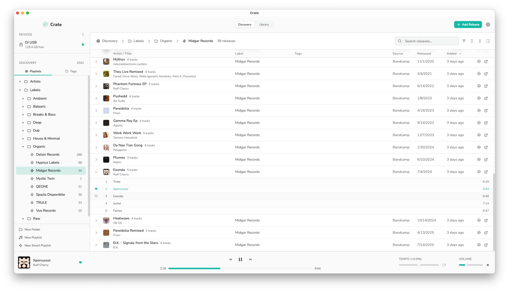

# Crate

[](https://github.com/blackboxaudio/crate/actions/workflows/ci.build.yml)
[](https://github.com/blackboxaudio/crate/actions/workflows/ci.lint.yml)

> Cross-platform DJ library manager with music discovery, track analysis, and USB export

<p align="center">
  
</p>

---

## 🎧 Overview

Crate is a cross-platform desktop application for managing DJ audio libraries. It handles everything from discovery, organization, analysis, and USB export.

## 🎵 Features

- **Library management** - Import and organize audio files (MP3, FLAC, WAV, AIFF, M4A/AAC) with automatic metadata extraction, search, and filtering
- **Tagging** - Categorize tracks with a flexible tag system for fast filtering
- **Playlists** - Build playlists manually or with smart rules
- **Track analysis** - Waveform generation, key detection, BPM analysis, and energy profiling
- **Music discovery** - Browse and preview releases from Bandcamp, SoundCloud, YouTube, and Discogs
- **Audio playback** - Preview tracks with waveform display and cue point management
- **USB export** - Export to Pioneer CDJ/XDJ devices with full Rekordbox database generation
- **Device sync** - Detect connected USB devices and sync library changes incrementally
- **Metadata editing** - Edit track metadata in bulk or individually
- **Customization** - Themes, accent colors, and font preferences
- **Localization** - Available in 11 languages (EN, JA, NL, FR, DE, ES, IT, SV, KO, PT, ZH)
- **Auto-updates** - Stay on the latest version with minimal effort

## 🚀 Getting Started

### Prerequisites

- **Node.js** 22.x or higher
- **Yarn** (package manager)
- **Rust** nightly toolchain

For Tauri development dependencies, see the [Tauri v2 prerequisites guide](https://v2.tauri.app/start/prerequisites/).

#### Windows

Windows requires [Strawberry Perl](https://strawberryperl.com/) to build SQLCipher with OpenSSL:

```powershell
choco install strawberryperl
```

Or download the installer from https://strawberryperl.com/. Restart your terminal after installation.

### Installation

Clone the repository:

```bash
git clone https://github.com/blackboxaudio/crate.git
cd crate
```

Install dependencies:

```bash
yarn install
```

### Development

Start the development server with hot reload:

```bash
yarn dev
```

This launches both the Vite dev server (port 1420) and the Tauri application window.

### Building

Build for production:

```bash
yarn build
```

Build for staging (with devtools):

```bash
yarn build:staging
```

Output binaries are placed in `src-tauri/target/release/bundle/`.

Platform targets:
- **macOS** - `.dmg`, `.app`
- **Windows** - `.msi`, `.exe`
- **iOS** - TestFlight / App Store (via CI)
- **Android** - signed `.apk` (via CI, attached to GitHub Releases)

### Mobile (iOS)

The iOS app reuses the Rust backend in `src-tauri/` and renders the mobile frontend from `apps/mobile/`. iOS development requires macOS.

**Prerequisites:**

- **Xcode** + Command Line Tools, and **CocoaPods** (`brew install cocoapods`)
- Rust iOS targets: `rustup target add aarch64-apple-ios aarch64-apple-ios-sim`
- An **Apple Developer Team ID** for code signing (find it under [Membership details](https://developer.apple.com/account#MembershipDetailsCard))

See the [Tauri iOS prerequisites](https://v2.tauri.app/start/prerequisites/) for the full list.

Code signing is **not** committed to the repo — supply your own team ID via the `APPLE_DEVELOPMENT_TEAM` environment variable (it overrides `tauri.conf.json`'s `bundle.iOS.developmentTeam`). Export it in your shell profile so every `tauri ios` command picks it up:

```bash
export APPLE_DEVELOPMENT_TEAM=XXXXXXXXXX   # your Apple Developer Team ID
```

The Xcode project is generated and not committed (`src-tauri/gen/apple` is gitignored), so scaffold it once (with `APPLE_DEVELOPMENT_TEAM` set):

```bash
yarn tauri ios init
```

Run the app in the iOS Simulator (or a connected device) with hot reload:

```bash
yarn dev:ios
```

Build for production:

```bash
yarn build:ios                # default iOS build
yarn build:ios:appstore       # App Store Connect (TestFlight / App Store)
yarn build:ios:adhoc          # ad-hoc distribution
yarn build:android:apk        # Android APK
yarn build:android:aab        # Android App Bundle
```

For signed release builds via CI, see [`.github/MOBILE_DISTRIBUTION.md`](.github/MOBILE_DISTRIBUTION.md).

The iOS scripts first generate `src-tauri/Info.ios.plist` (adds background-audio mode for preview playback, and the OAuth callback URL scheme for cloud sign-in). The scheme is derived from `ios_oauth_client_id` in `src-tauri/cloud_sync.config.json` (see `cloud_sync.config.example.json`); without it the app still builds, but cloud sign-in is unavailable.

## 🔗 Links

- [Website & Downloads](https://crate.bbx-audio.com)
- [Issues](https://github.com/blackboxaudio/crate/issues)
- [Releases](https://github.com/blackboxaudio/crate/releases)

## ⚠️ Disclaimer

Crate's discovery features interact with third-party music services for browsing and previewing content. These features are intended for personal use only. Users are responsible for ensuring their usage complies with applicable terms of service.

## 📄 License

This project is source-available under the [PolyForm Shield License 1.0.0](LICENSE). You can read, learn from, and contribute to the code, but you can't use it to build a competing product.
